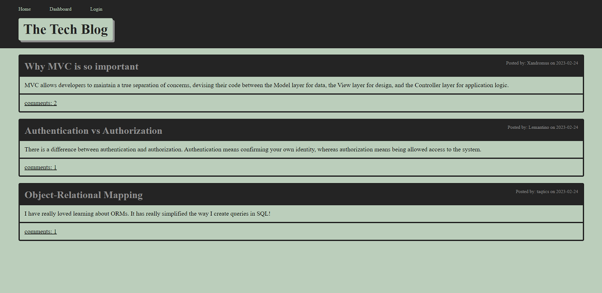
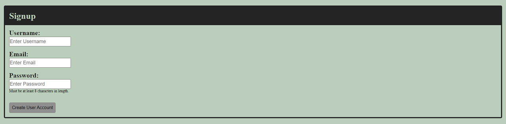
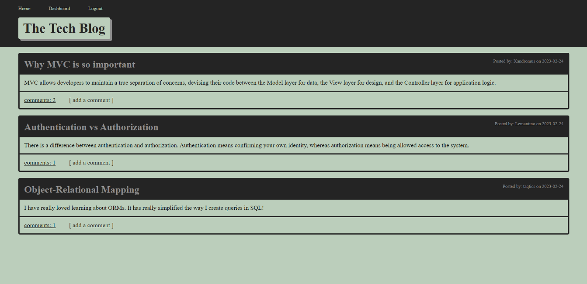
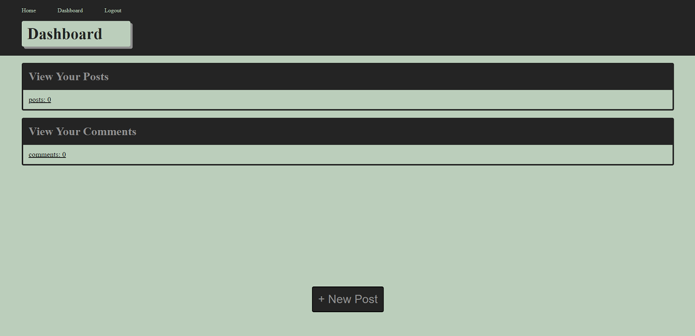

# **The Dev Tech Blog**

### This is a CMS-style blog site similar to a Wordpress site.  Following the MVC paradigm in its architectural structure, using Handlebars.js as the templating language, Sequelize as the ORM, and the express-session npm package for authentication was used in the creation of this site.  This is what allows a way for developers to publish their own blog posts and comment to other developer posts.  Please remain kind and courteous (all unacceptable post/comments will be deleted).  Enjoy!  

## Usage:
  
When first entering the site one will be able to view all posts and comments to those posts.  Once a user creates a new account by signing up or logs in with a pre-created user account, they will then see a link to add a comment to a post on the homepage.  The user may then travel to the dashboard link located in the nav section in the header.  Once arriving on the dashboard the user may then create their own post or update/delete any post or comment information by selection.  

***Homepage to All viewers***

***Viewer Sign up***

***Logged in User views***

## Future Changes:

Implement comment to comment relationship for more diverse communication.

## Resources:

## Location:

Live URL:&nbsp;&nbsp;[Heroku - The Dev Tech Blog](https://the-tech-blog-post.herokuapp.com/)

Code Location:&nbsp;&nbsp;[GitHub Repository](https://github.com/zMag33z/week-14-MVC-Tech_Blog)

## License:
  

  
See *Terms & Conditions* of the license [***here***](https://opensource.org/licenses/MIT).

 

#### [**Back to top**](#)